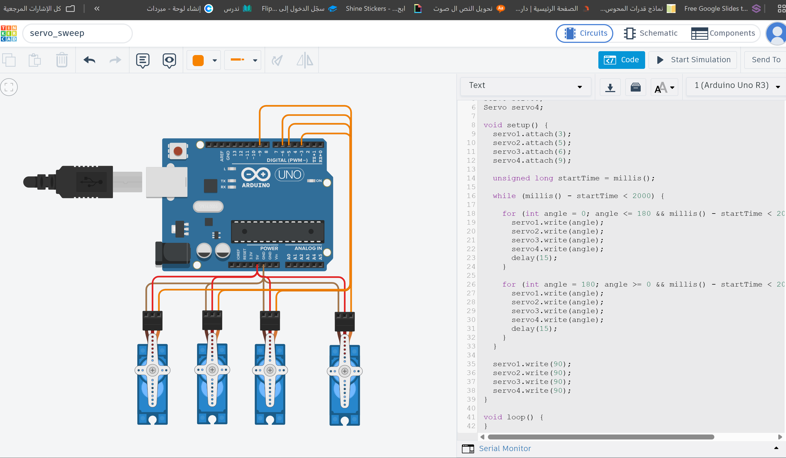
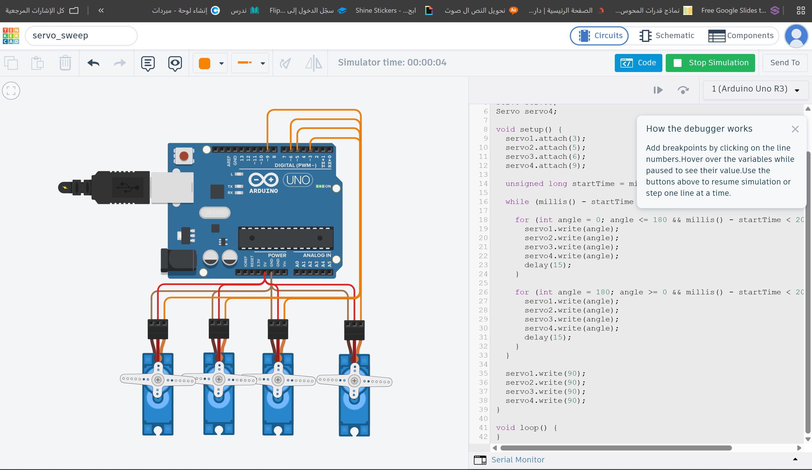

# Task: 4 Servo Motor Sweep

## Description

This project simulates four servo motors using Arduino Uno in Tinkercad.

The program performs two sequential movements:

1. All four servo motors perform the Sweep movement for 2 seconds.
2. After 2 seconds, all servo motors stop and remain fixed at a 90° angle.

## Components

- Arduino Uno
- 4 Servo Motors
- Jumper Wires

## Circuit Connections

| Servo Motor | Signal Pin |
|-------------|------------|
| Servo 1 | D3 |
| Servo 2 | D5 |
| Servo 3 | D6 |
| Servo 4 | D9 |

All servo motors share:

- VCC → 5V
- GND → GND

## How It Works

1. The Arduino initializes the four servo motors.
2. All servo motors perform the Sweep movement simultaneously for 2 seconds.
3. After the 2 seconds, all servo motors move to the 90° position.
4. The motors remain fixed at 90° until the simulation is stopped.

## Software

- Tinkercad
- Arduino IDE (Text Mode)

## Files

- servo_sweep1.ino
- README.md
- servo_sweep_demo.mp4

## Result

The simulation successfully controls four servo motors at the same time. They perform the Sweep movement for two seconds and then stop together at a 90° position.

## Screenshots

### Circuit

### Simulation

## Demo

Simulation video: **servo_sweep_demo.mp4**
